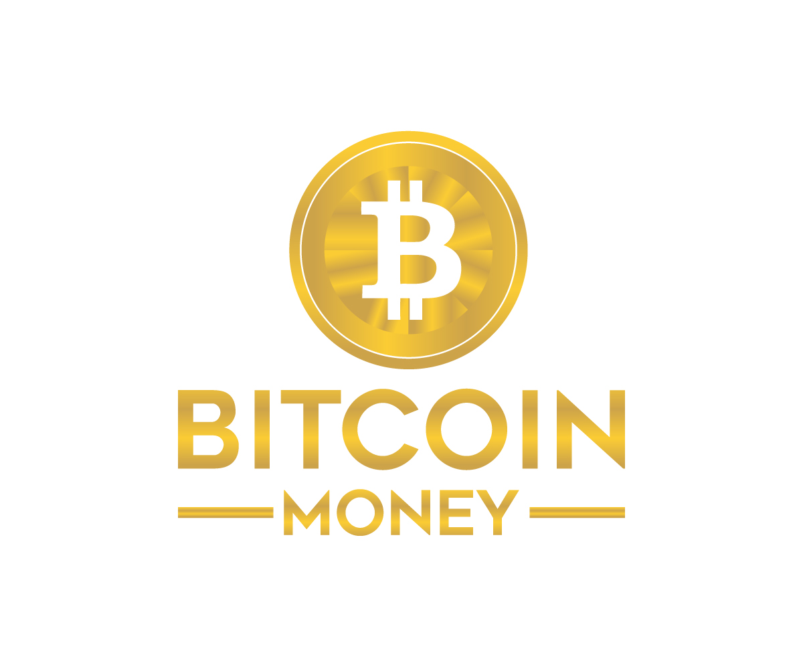

# Bitcoin Money



## Introduction

BITCOIN MONEY is a decentralized global cryptocurrency exchange aimed at solving the challenges of crypto trading and international payments using its unique strategy. Our goal is to be a bridge to everyone and a solution to critical problems that improve the quality of life. To enhance the quality of life, you need financial freedom.

## Tokenomics

| Token Name:    | Bitcoin Money         |
| -------------- | --------------------- |
| Token Symbol:  | BTCMY                 |
| Token Supply:  | 1,000,000,000,000,000 |
| Network:       | Binance Smart Chain   |
| Specification: | BEP20                 |
| Precision:     | 8                     |

## Problems

| Problems                | BTCMY Solutions           |
| ----------------------- | ------------------------- |
| Interoperability issues | Interoperability          |
| High Transaction fees   | Cheaper Transactions fees |
| Slow Transaction speed  | High Transaction Speed    |

## Roadmap


## Contract Code

### ERC20 Functions
```javascript
interface IBEP20 {

    function totalSupply() external view returns (uint256);

    function decimals() external view returns (uint8);

    function symbol() external view returns (string memory);

    function name() external view returns (string memory);

    function getOwner() external view returns (address);

    function balanceOf(address account) external view returns (uint256);

    function transfer(address recipient, uint256 amount)
        external
        returns (bool);

    function allowance(address _owner, address spender)
        external
        view
        returns (uint256);

    function approve(address spender, uint256 amount) external returns (bool);

    function transferFrom(
        address sender,
        address recipient,
        uint256 amount
    ) external returns (bool);

    event Transfer(address indexed from, address indexed to, uint256 value);

    event Approval(
        address indexed owner,
        address indexed spender,
        uint256 value
    );
```

### Constructor
```javascript
    constructor() public {
        _name = "Bitcoin Money";
        _symbol = "BTCMY";
        _decimals = 8;
        _totalSupply = 1000000000000000 * 10**8;
        _balances[msg.sender] = _totalSupply;

        emit Transfer(address(0), msg.sender, _totalSupply);
    }

```

## OUR PROPOSED SOLUTION 
### Interoperability
BITCOIN MONEY is built with a dual chain architecture, which makes it possible for users to enjoy the flexibility of transferring assets from one blockchain to another. The interoperability of BinanceSmart Chain offers users the opportunity of accessing a vast ecosystem with a myriad of use cases. Interoperability is one of the key features held in high esteem by DeFi proponents, and Binance Smart Chain is at the forefront of making this possible. 

### Cheaper Transactions fees
Transaction fees - also known as blockchain fees - refer to the fee users pay when they conduct a transaction on a blockchain. This fee is collected by miners or validators who ensure that the blockchain only records and processes valid transactions. Most DeFi applications involve myriads of transactions, which incur transaction fees at every step. For this reason, blockchain fees are an important factor to consider before choosing a blockchain protocol. Binance Smart Chain and Ethereum are two of the most common blockchains of choice for Defi projects. But when it comes to blockchain fees BITCOIN MONEY is substantially more cost-effective than Ethereum. 

### High Transaction Speed
Blockchain transactions require a number of confirmations before a transaction can be completely processed. The essence of confirmations is to avoid the risk of double-spending. The longer the confirmation time, the longer the time it takes for a transaction to be completed. 1311-COIN MONEY was specifically designed to enhance scalability in blockchains with high throughput for easy implementation of smart contracts to build scalable decentralized applications. 
BITCOIN MONEY was built with a similar structure as the existing Binance Chain, a high-performance, low-latency blockchain, but as a design choice to enhance speed, it was not able to handle smart contracts. 

## CONCLUSION 
BITCOIN MONEY is a blockchain technology integrated platform which will help solve challenges faced by crypto traders thereby offering excellent services to her clients in making payment with low transaction fees. Supply will shrink through periodic burns of the tokens to make the supply less. We believe we are enlarging our company through this because a good reputation brings good development and success Considering the increasing interest of people in crypto-assets and their inability to quickly and easily get the market's hang, BITCOIN MONEY has built a reliable and user-friendly trading and payment platform with low transaction fees. 

## Implementation
There are already plenty of ERC20-compliant tokens deployed on the Ethereum network. Different implementations have been written by various teams that have different trade-offs: from gas saving to improved security.

**Example implementations are available at**
- [OpenZeppelin implementation](https://github.com/OpenZeppelin/openzeppelin-solidity/blob/9b3710465583284b8c4c5d2245749246bb2e0094/contracts/token/ERC20/ERC20.sol)

## History
Historical links related to this standard:

- Original proposal from Vitalik Buterin: https://github.com/ethereum/wiki/wiki/Standardized_Contract_APIs/499c882f3ec123537fc2fccd57eaa29e6032fe4a
- Reddit discussion: https://www.reddit.com/r/ethereum/comments/3n8fkn/lets_talk_about_the_coin_standard/
- Original Issue #20: https://github.com/ethereum/EIPs/issues/20

# Copyright
Copyright Reserved.
